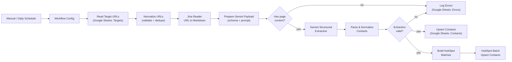

# Autonomous B2B Web & Social Media Crawler

> An n8n workflow that turns a list of company URLs into structured, CRM-ready contact records. It reads pages with **Jina Reader**, extracts entities with **Gemini's strict JSON output**, and writes the results to **Google Sheets** and **HubSpot** custom contact properties.

## Overview

Scraping contact data from unstructured company websites usually means brittle CSS selectors and heavy DOM traversal. This pipeline skips both:

1. **Jina Reader** converts any URL into clean markdown, with the page's social and `mailto:` links returned separately.
2. **Gemini** reads that markdown and returns JSON that conforms to a fixed `responseSchema`. No regex parsing or selector maintenance is needed.
3. A validation layer cleans the output, drops unverifiable emails, and splits each page into one record per contact.
4. Records are upserted into **Google Sheets** (audit trail) and **HubSpot** (CRM) without creating duplicates.

## Architecture



## Features

- **No DOM traversal.** Jina Reader handles rendering and markdown conversion, so the workflow needs no per-site selectors.
- **Schema-enforced extraction.** Gemini runs with `responseMimeType: application/json` and a `responseSchema` covering company profile and contacts (name, title, department, email, phone, LinkedIn/Twitter, location, confidence).
- **Anti-hallucination check.** An extracted email is kept only if it literally appears in the crawled page text or its links.
- **Multi-contact pages.** Team and leadership pages produce one record per person. Pages with no named people fall back to a company-level lead when a general email or phone exists.
- **Idempotent writes.**
  - Google Sheets: append-or-update on `dedupe_key` (email, else LinkedIn URL, else name plus company).
  - HubSpot: batch upsert keyed on email.
- **Safe CRM updates.** Blank values are omitted from HubSpot payloads, so a re-crawl never overwrites existing data with empty strings.
- **Confidence gate.** Only contacts at or above `min_confidence` (default `0.5`) are sent to HubSpot. Everything is still saved to Sheets.
- **Resilient.** Retries with backoff, request batching to respect rate limits, and a dedicated `Errors` tab for pages that fail.
- **Single config node.** Spreadsheet ID, Gemini model, confidence cutoff and page-size cap live in one place.

## Tech stack

| Layer | Tool |
|---|---|
| Orchestration | n8n (1.x) |
| Page fetch + markdown | [Jina Reader](https://jina.ai/reader) (`r.jina.ai`) |
| Entity extraction | Google Gemini API (`generateContent`, structured output) |
| Storage / audit | Google Sheets |
| CRM | HubSpot CRM v3 (`contacts/batch/upsert`) |

## Repository contents

```
.
├── b2b_crawler_workflow.json   # importable n8n workflow
└── README.md
```

## Prerequisites

- An n8n instance (cloud or self-hosted, v1.x)
- A Google account with a spreadsheet you can edit
- A Jina API key (optional for low volume, recommended for higher rate limits)
- A Gemini API key from Google AI Studio
- A HubSpot **private app** token with the `crm.objects.contacts.write` scope (add `crm.objects.contacts.read` if you want to inspect results)

## Setup

### 1. Import the workflow
In n8n: **Workflows → Import from file →** `b2b_crawler_workflow.json`.

### 2. Prepare the Google Sheet
Create one spreadsheet with three tabs.

**`Targets`**: one URL per row, header in row 1:

```
url
```

**`Contacts`**: paste this header row into row 1 (tab-separated):

```
dedupe_key	full_name	first_name	last_name	job_title	department	email	phone	contact_linkedin_url	contact_twitter_url	location	company_name	company_website	company_industry	company_description	company_hq	company_size	company_linkedin_url	company_twitter_url	company_facebook_url	company_instagram_url	company_youtube_url	confidence	record_type	source_url	scraped_at
```

**`Errors`**:

```
source_url	error	logged_at
```

### 3. Create credentials in n8n

| Credential type | Used by | Configuration |
|---|---|---|
| Google Sheets OAuth2 | 3 Sheets nodes | Sign in with Google |
| Header Auth ("Jina AI API Key") | Jina Reader node | Name: `Authorization`, Value: `Bearer <JINA_KEY>` |
| Header Auth ("Gemini API Key") | Gemini node | Name: `x-goog-api-key`, Value: `<GEMINI_KEY>` |
| HubSpot App Token | HubSpot node | Private app access token |

The imported file contains `REPLACE_ME` credential placeholders. Open each node and select your credential.

### 4. Create the HubSpot custom properties
In **Settings → Properties → Contact properties**, create the following. Use the exact **internal names**, because HubSpot rejects unknown properties.

| Internal name | Field type |
|---|---|
| `crawler_source_url` | Single-line text |
| `crawler_department` | Single-line text |
| `crawler_contact_linkedin` | Single-line text |
| `crawler_contact_twitter` | Single-line text |
| `crawler_company_industry` | Single-line text |
| `crawler_company_size` | Single-line text |
| `crawler_company_description` | Multi-line text |
| `crawler_company_linkedin` | Single-line text |
| `crawler_company_twitter` | Single-line text |
| `crawler_company_facebook` | Single-line text |
| `crawler_company_instagram` | Single-line text |
| `crawler_confidence` | Number |
| `crawler_scraped_at` | Single-line text |

Standard properties (`firstname`, `lastname`, `jobtitle`, `phone`, `company`, `website`) already exist.

### 5. Configure and run
1. Open the **Workflow Config** node and set `spreadsheet_id` (the long ID in the sheet URL).
2. Run with **Manual Trigger** and check the `Contacts`, `Errors` and HubSpot results.
3. Enable **Daily Schedule** once you're happy.

## Configuration reference

Set in the **Workflow Config** node:

| Key | Default | Description |
|---|---|---|
| `spreadsheet_id` | *(required)* | Google Sheet holding `Targets`, `Contacts`, `Errors` |
| `gemini_model` | `gemini-2.5-flash` | Any Gemini model that supports structured output |
| `min_confidence` | `0.5` | Minimum confidence for a contact to be pushed to HubSpot |
| `max_page_chars` | `60000` | Markdown is truncated to this length before extraction |

Throughput settings, which you can edit on the HTTP nodes:

- Jina: 2 requests per 1.5 s, 3 retries
- Gemini: 3 requests per 1 s, 3 retries
- HubSpot: up to 100 contacts per request, 3 retries

## Output data model

Each page becomes one or more flat records:

| Group | Fields |
|---|---|
| Contact | `full_name`, `first_name`, `last_name`, `job_title`, `department`, `email`, `phone`, `contact_linkedin_url`, `contact_twitter_url`, `location` |
| Company | `company_name`, `company_website`, `company_industry`, `company_description`, `company_hq`, `company_size`, `company_linkedin_url`, `company_twitter_url`, `company_facebook_url`, `company_instagram_url`, `company_youtube_url` |
| Meta | `confidence` (0 to 1), `record_type` (`person` or `company_general`), `source_url`, `scraped_at`, `dedupe_key` |

## Error handling

| Situation | Behavior |
|---|---|
| Jina fetch fails or returns no content | Logged to `Errors`, Gemini is skipped |
| Gemini call fails, is blocked, or returns invalid JSON | Logged to `Errors` |
| Page has no contacts and no general email or phone | Logged as "No contact entities found on page" |
| HubSpot request fails | Retried 3 times, then the run continues so Sheets writes are unaffected |

## Customizing

- **Different fields:** edit the `schema` object in **Prepare Gemini Payload**, the mapping in **Parse & Normalize Contacts**, and the `raw` object in **Build HubSpot Batches**. Add matching columns to the sheet and matching properties in HubSpot.
- **Different model:** change `gemini_model`. The code applies `temperature` and thinking settings only to Gemini 2.x models, because newer models deprecate them.
- **Other sources:** replace the **Read Target URLs** node with a Webhook, Airtable, or database node. Downstream nodes only need a `url` field.
- **Other CRMs:** swap the last HTTP node and the payload builder.

## Limitations

- Emails that are obfuscated on the page (for example `name [at] site.com`) are dropped by the verification step.
- Pages behind logins or aggressive bot protection may return empty content.
- Social platforms such as LinkedIn generally block scraping. This workflow captures profile links found on company pages and does not scrape the social platforms themselves.
- Very large pages are truncated to `max_page_chars`.
- Extracted data is model output. Review the `confidence` column before acting on low-scoring records.

## Compliance

Only crawl sites you are permitted to crawl. Respect each site's terms of service and `robots.txt`, and handle collected personal data in line with GDPR, CCPA, CAN-SPAM and similar regulations for your region and outreach method.

## License

MIT
